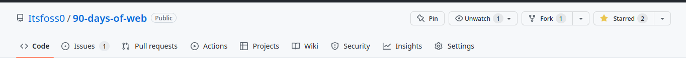

# Contrbution Guide
Thank you for your interest in contributing. Follow these simple steps to add your contributions. 

1. Fork this repo to create your own copy 



2. Clone the forked repo to your local machine. 

```
git clone https://github.com/<github-username>/90-days-of-web.git/
```

3. Create a new branch in your local repository and add your contributions

```
git checkout -b <branch-name>

```

4. Stage and commit your files to the local repository

```
git add . 

```
```
git commit -m "Commit Message"

```
5. Push the changes to your remote repository and open a Pull request

```
git push origin <branch-name>

```